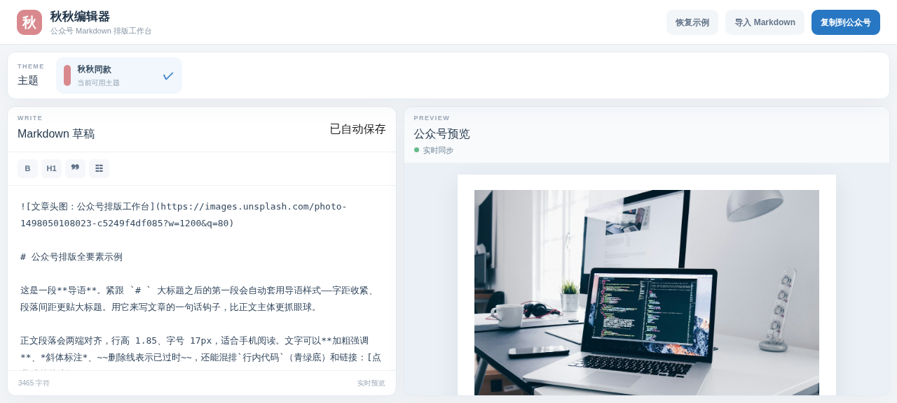

<p align="center">

# 秋秋公众号编辑器 · QiuQiu WeChat Editor

**Markdown → 公众号精美排版，一键所见即所得。**

自动章节号 · 图片轮播 / 竖图自适应 · 嵌套列表 · 数据表格 · Callout —— 生成全内联样式，粘贴微信后台**不丢格式**。

在线体验 **[wangsiji.github.io/qiuqiu-wechat-editor](https://wangsiji.github.io/qiuqiu-wechat-editor/)** · 网页版 & Obsidian 插件

</p>

<p align="center">
  
</p>

<p align="center">
  
  
  
</p>

---

**为什么有这个项目？** 公众号后台排版费时又丑，字体颜色全靠手工，且微信粘贴时会清掉 class 样式。这套内核把所有样式**直接写进 `style`**，一行命令、一种语法，换来的是一份**粘贴即终稿**的公众号文章。预览和复制走同一份 HTML——看到什么，粘贴出来就是什么。

---

## 目录

- [快速开始](#快速开始)
- [渲染能力](#渲染能力)
- [两个入口](#两个入口)
  - [Web 工作台](#web-工作台)
  - [Obsidian 插件](#obsidian-插件)
- [架构](#架构)
- [开发](#开发)
- [License](#license)

---

## 快速开始

```bash
git clone https://github.com/wangsiji/qiuqiu-wechat-editor.git
cd qiuqiu-wechat-editor
npm install
npm run dev        # 本地预览：网页工作台 → http://localhost:5173/qiuqiu-wechat-editor/
npm run test       # 渲染内核单元测试
```

打开浏览器进入工作台，左边写 Markdown、右边实时渲染，点 **「复制到公众号」** 去微信后台 Ctrl+V —— 完成。写的内容自动存 localStorage，不怕丢。

前置要求：**Node ≥ 22**。

---

## 核心功能

- **自动章节号**：一级标题 → 大数字章节；二级标题 → `1.1｜` 小节号；检测到手写编号 / 旧模板时沿用原样式。
- **图片自适应**：单图通栏居中；**竖图自动缩到 75% 宽**；连续多行图自动并成**可左右滑动的相册**（默认只显示首张，横图 100% / 竖图 75%）。Obsidian 本地图自动转 base64 内联。
- **所见即所得**：预览与「复制到公众号」走同一渲染管线，粘贴后样式全保真。
- **结构化排版**：嵌套列表 / 数据表格 / 引用快讯 / Callout 提示条 / 代码块 / 居中线。
- **防坑 & 安全**：只用微信稳定标签、样式写进 `style` 不依赖 class；链接 URL 白名单防 `javascript:`；分隔线不用 `<section>`（微信会误判容器）。

---

## 两个入口

同一套 `lib/` 渲染内核，网页与插件共用：

### Web 工作台

浏览器直接排版，适合快速试玩、临时拖稿。

```
npm run dev   # → http://localhost:5173/qiuqiu-wechat-editor/
```

### Obsidian 插件

在 Obsidian 笔记里就地渲染，本地图自动内联传送。

```bash
cd obsidian-plugin
npm install && npm run build           # 产出 main.js

mkdir -p ~/你的vault/.obsidian/plugins/qiuqiu-wechat-editor
cp main.js manifest.json styles.css ~/你的vault/.obsidian/plugins/qiuqiu-wechat-editor/
```

启用后 `Cmd/Ctrl+P` → **秋秋编辑器**，或点左侧滑轮图标；当前笔记自动载入、随编辑实时刷新，点「复制到公众号」一键导出。详见 [obsidian-plugin README](./obsidian-plugin/README.md)。

---

## 架构

**单一渲染内核，杜绝两端漂移：**

```
lib/                 ← 唯一渲染内核（网页 + 插件共用）
  render.ts          预览 DOM 渲染（真 <ul>/<ol>、章节号、表格、轮播）
  wechat.ts          公众号导出（全内联 HTML，只依赖微信稳定标签）
  client.ts          浏览器侧工具（竖图检测、富文本复制）
      │
      ├── app/                      Web 工作台（Vinext）
      │     page.tsx  ← 编辑器交互 + 预览
      └── obsidian-plugin/          Obsidian 插件
            input.ts  ← ItemView 入口，复用同一个 lib/
```

> 网页与插件都用**同一份 `renderWechat` 管线**做预览和复制——所以你没有"两套 WYSIWYG 对不齐"的坑。改 `lib/` 一处，两端同更。

---

## 开发

```bash
npm run lint               # ESLint
npm test                     # 渲染内核单测（tests/*.test.mjs）
cd obsidian-plugin && npm test   # 插件侧冒烟
```

- 新功能改 `lib/`，加测试到 `tests/`，`npm test` 覆盖。
- 发布：网页 `npm run build` + GitHub Actions（`deploy-pages.yml`）；插件发版走 `release-obsidian-plugin.yml`。

---

## License

[MIT](./LICENSE)